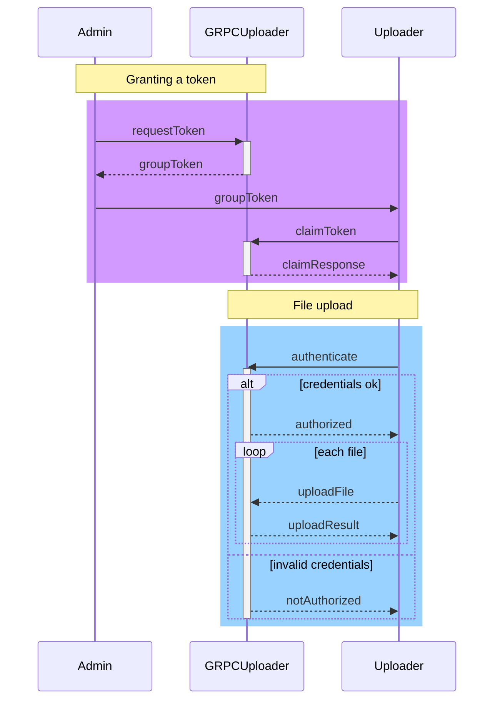
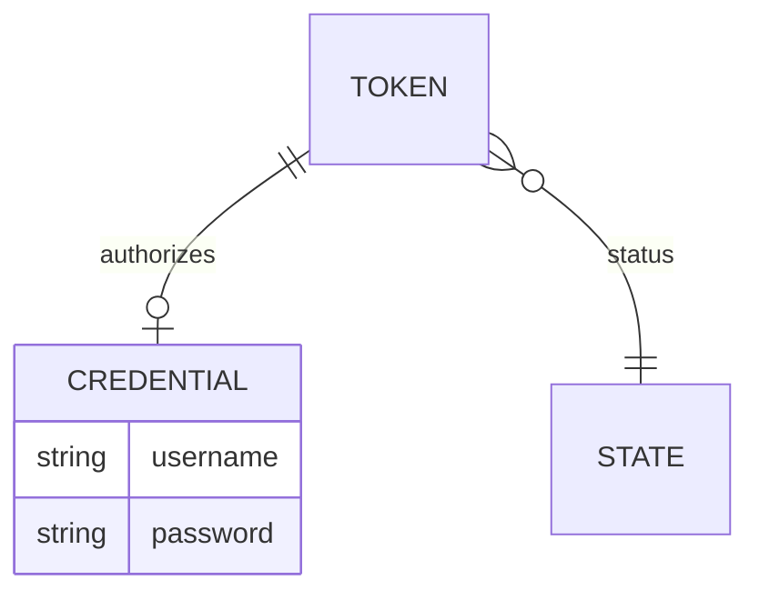

The following document outlines some of the behaviour of the system. These documents are not normative (only the sourcecode can claim such)
and are instead illustrative (and rough illustrations at that).

The general notion of the system is that an administrator may, with an administrative token, generate group tokens. These group tokens may then be passed to Uploaders who may then use the token to set their desired credentials (user/password). The Uploader may then utilize the credentials to authenticate against the service and upload.

Group tokens are utilized initially by the Uploader to configure their credentials. The credentials are then associated with the token, and act as a user-friendly way to identify oneself for authorization. It should be noted however that it is still the token itself which acts as the fundemental source of authorization. If a token is revoked, the credentials are no longer valid until the token is once again enabled.

There is only ever one administrator token, generated upon initiating the program. Unlike group tokens, it is never associated with any credentials, nor is it revokable.

The stored data model is quite simple, given that only tokens, their state, and the associated credentials need to be persisted.

